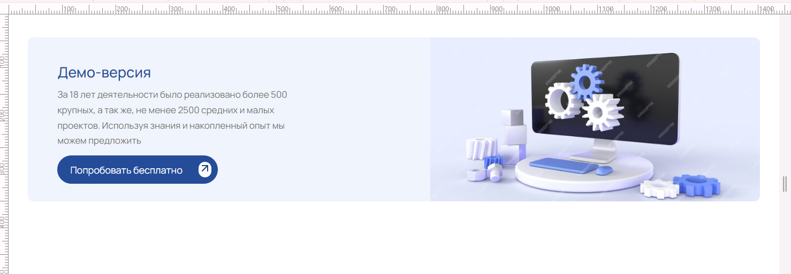

  <a href='https://main--test-layout-kate-goncharik.netlify.app/'>
    
    
    <h1 align="center">Test layout project</h1>
  </a>

<!-- TABLE OF CONTENTS -->

  
Table of Contents

  <ol>
    <li>
      <a href="#about-the-project">About The Project</a>
      <ul>
        <li><a href="#technology-stack">Technology stack</a></li>
      </ul>
    </li>
    <li>
      <a href="#getting-started">Getting Started</a>
      <ul>
       <li><a href="#installation">Installation</a></li>
      </ul>
    </li>

  </ol>

<!-- ABOUT THE PROJECT -->

## About The Project

### _Test layout project_

_Completed: July 2024_

Check out deployment - [at netlify](https://main--test-layout-kate-goncharik.netlify.app/)

Application is responsive with minimum resolution of 375px and maximum of 1920px.

#### [Link to task from author](https://docs.google.com/document/d/1w0j6Devb16fSJeukf1uMV6t3O1-kUnSfJSLBZW-dWww/edit)

### Technology stack

[![NPM][NPM]][NPM-url]

[![Javascript][Javascript]][Javascript-url]

[![HTML5][HTML5]][HTML5-url]

[![CSS3][CSS3]][CSS3-url]

[![Prettier][Prettier]][Prettier-url]

[![Eslint][Eslint]][Eslint-url]

[![Netlify][Netlify]][Netlify-url]

(<a href="#readme-top">back to top</a>)

<!-- GETTING STARTED -->

## Getting Started

This is an example of how you may give instructions on setting up your project locally.
To get a local copy up and running follow these simple example steps.

### Installation

_Below is an example of how to install and configure the application._

1. Clone the repo

   sh
   git clone <https://github.com/KateGoncharik/layout.git>

2. Install NPM packages

   sh
   npm install

(<a href="#readme-top">back to top</a>)

[NPM]: https://img.shields.io/badge/NPM-%23CB3837.svg?style=for-the-badge&logo=npm&logoColor=white
[NPM-url]: https://www.npmjs.com
[HTML5]: https://img.shields.io/badge/html5-%23E34F26.svg?style=for-the-badge&logo=html5&logoColor=white
[HTML5-url]: https://html.com/html5/
[Prettier]: https://img.shields.io/badge/prettier-1A2C34?style=for-the-badge&logo=prettier&logoColor=F7BA3E
[Prettier-url]: https://prettier.io/
[Eslint]: https://img.shields.io/badge/eslint-3A33D1?style=for-the-badge&logo=eslint&logoColor=white
[Eslint-url]: https://eslint.org/
[CSS3]: https://img.shields.io/badge/CSS3-1572B6?style=for-the-badge&logo=css3&logoColor=white
[CSS3-url]: https://ru.wikipedia.org/wiki/CSS
[Javascript]: https://img.shields.io/badge/JavaScript-323330?style=for-the-badge&logo=javascript&logoColor=F7DF1E
[Javascript-url]: https://developer.mozilla.org/en-US/docs/Learn/JavaScript/First_steps/What_is_JavaScript
[Netlify]: https://img.shields.io/badge/netlify-%23000000.svg?style=for-the-badge&logo=netlify&logoColor=#00C7B7
[Netlify-url]: https://www.netlify.com/
